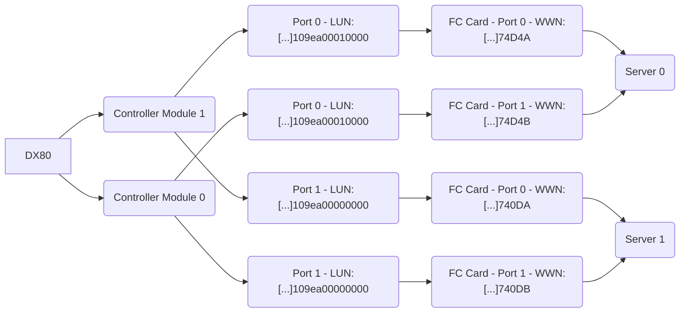
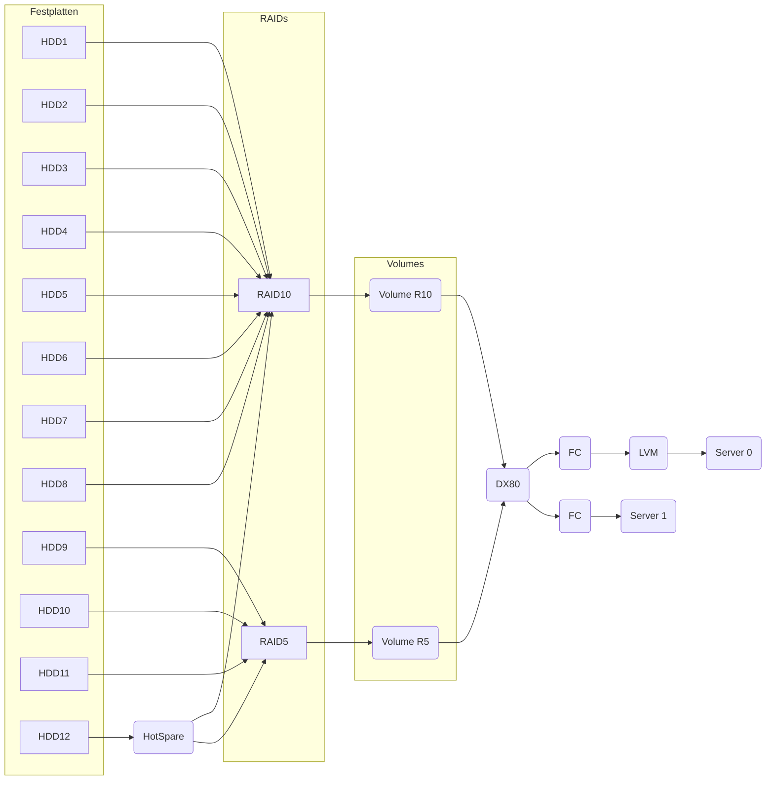
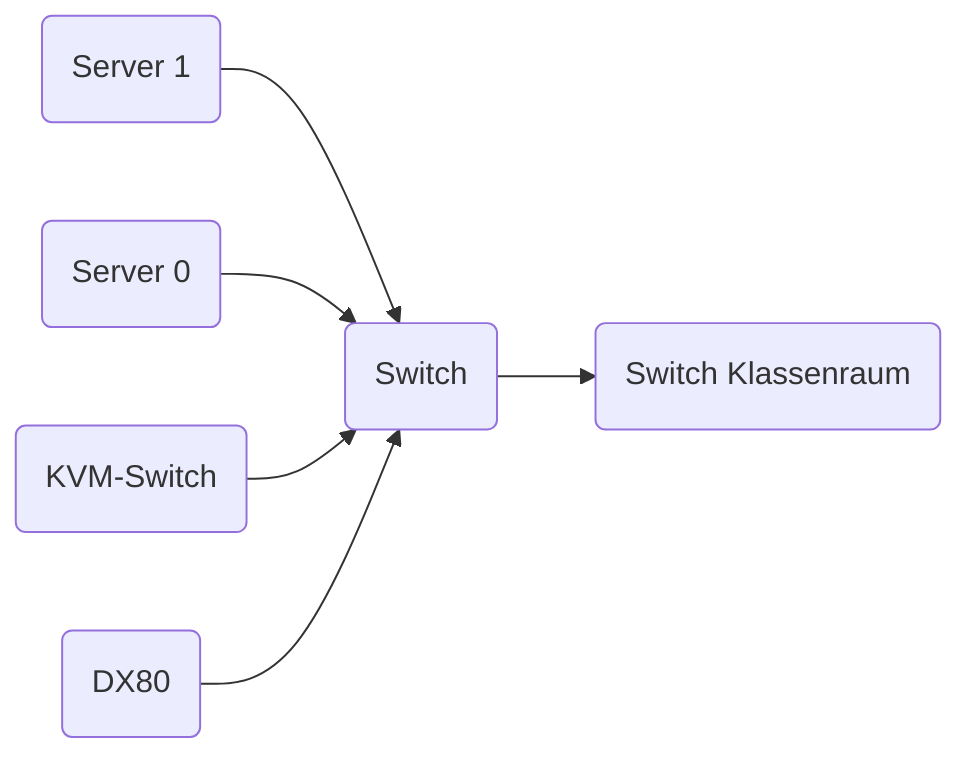

# Dokumentation "Schulserver"
<!-- TOC depthFrom:1 depthTo:6 withLinks:1 updateOnSave:1 orderedList:0 -->

- [Dokumentation "Schulserver"](#dokumentation-schulserver)
		- [Übersicht](#übersicht)
			- [Server](#server)
			- [Storage](#storage)
			- [KVM-Switch](#kvm-switch)
			- [Ethernet-Switch](#ethernet-switch)
			- [Kabel](#kabel)
			- [Konsole](#konsole)
				- [Netzwerkkonfiguration](#netzwerkkonfiguration)
				- [Lizenzerinnerung ausblenden](#lizenzerinnerung-ausblenden)
		- [Fileserver](#fileserver)
			- [Storage](#storage)
			- [Logische Verkabelung](#logische-verkabelung)
			- [Aufbau Speichersystem](#aufbau-speichersystem)
		- [Netzwerk](#netzwerk)
			- [Logische Netzstruktur](#logische-netzstruktur)
			- [Verkabelung](#verkabelung)
			- [IPs](#ips)
					- [KVM](#kvm)
					- [Server 0](#server-0)
					- [Server 1](#server-1)
					- [Eternus DX80](#eternus-dx80)
					- [Gateway](#gateway)
					- [Nameserver](#nameserver)
		- [Berechtigungen](#berechtigungen)
					- [Rollen siehe:](#rollen-siehe)
		- [Server](#server)
					- [Siehe auch:](#siehe-auch)

<!-- /TOC -->

### Übersicht
Das Gesamtsystem besteht aus 2x Fujitsu-Siemens RX200 S7 Servern und dem Storage, einer Fujitsu-Siemens DX80.
Weiterhin gehören ein Ethernetswitch, ein KVM-Umschalter + Konsole dazu.
Die Server sind per FibreChannel direkt und über Kreuz an die DX80 angeschlossen. Dadurch kann jeweils entweder ein Pfad, ein Controller der DX80 oder ein Port eines FC-Netzwerkkarte ausfallen ohne das der Betrieb beeinträchtigt wird.
Die Server sind über ihre Netzwerkanschlüsse mit dem Switch verbunden.
Zugleich sind die Server auch an den KVM-Switch angebunden. Dieser ist auch mit dem Switch verbunden.
#### Server
- Fujitsu Primergy RX200 S7 - SN: YLAQ005822
- Fujitsu Primergy RX200 S7 - SN: YLAQ005821
#### Storage
- Fujitsu Eternus DX80 - SN: YL2A001390
#### KVM-Switch
- Fujitsu Console Switch KVM S4-1622 - SN: 0510091069
#### Ethernet-Switch
- Level1 GSW-2473 - SN: 08062007042
#### Kabel
- 4x FC-Kabel - LC-Duplex-Stecker
- 2x Ethernet-Kabel - blau (KVM)
- 4x Ethernet-Kabel - rot
- 2x Ethernet-Kabel - schwarz
#### Konsole
- Fuitsu-Siemens RC23 Rack Console - SN: 947728

##### Netzwerkkonfiguration
Dann
* IP, Gateway und DNS-Server werden bei der Installation eingerichtet

Dafür geht man zuerst in die WebGUI und gibt dort die Adresse die auf dem Bildschirm des Servers erscheint ein (z.B. https://192.168.100.1:8006)

  * falls nicht funktioniert
	`nano /etc/network/interfaces` und `nano /etc/hosts` bearbeiten

	* danach `init 6`

Bei Problemen zu:
    * [Ubuntu-Users](https://wiki.ubuntuusers.de/interfaces/)

- Unter "VM" -> System -> DNS lassen sich die DNS Einstellungen auch nochmal anpassen. Note: Dann unter Datacenter  das VM auswählen, dann unter Reiter System DNS auswählen

##### Lizenzerinnerung ausblenden
`wget https://raw.githubusercontent.com/foundObjects/pve-nag-buster/master/install.sh && bash install.sh`

### Fileserver

#### Storage
Der Storage wird durch eine Fujitsu Eternus DX80 bereitgestellt.
Das System hat 12 Festplatten, wovon 3 ein RAID5, 8 ein RAID10 bilden und eine Festplatte als Hot-Spare bereitgehalten wird. Jeweils auf den beiden RAIDs liegt ein Volume was für je einen Server exportiert wird. (Siehe dazu die Übersichtsdiagramme)
Die Server sind per FibreChannel "über Kreuz" angeschlossen, d.h. jeder Server hat einen Controller mit zwei Ports, jeder Port ist an beide Controller des Storages angebunden. Daher kann entweder ein Controller des Storages ausfallen oder auch ein Port je Server ohne das die Verfügbarkeit des Speicher eingeschränkt ist.

#### Logische Verkabelung

#### Aufbau Speichersystem

### Netzwerk
Das Rack interne Netzwerk ist sternförmig aufgebaut. Die Server, der KVM-Switch und der Storage sind direkt an den Switch angebunden. Das Klassenraumnetzwerk ist auch wiederum sternförmig aufgebaut mit eigenen Switchen. Diese sind über Uplink-Verbindungen mit dem Rack-Switch verbunden.
Bei den Servern ist sowohl das Management-Interface und der vSwitch für die VMs über eine physikalische Schnittstelle erreichbar. Das IPMI-Interface ist auch physisch extra zum Switch verkabelt.
Der Switch ist "manage"-bar aber momentan "plain" konfiguriert.
Die Server befinden sich im Netz: `172.16.21.0/16` zusammen mit einem bereits existierenden Server mit der IP: `172.17.19.224`
Der Storage, der KVM-Switch und die IPMI-Schnittstellen sind im Netz: `192.168.7.0/24`

#### Logische Netzstruktur

#### Verkabelung

[Visio Shape](./zusammenfassen/Verkabelung.vsdx)

#### IPs
Die IPs müssen fest gesetzt werden.

###### KVM
- OS: 172.16.19.103
###### Server 0
- Name: server0
- IPMI: 192.168.7.1
- <s>OS: 192.168.137.2</s>
- OS: 172.16.21.116
- https + Port:8006
###### Server 1
- Name: server1
- IPMI: 192.168.7.2
- OS: 172.16.21.35
###### Eternus DX80
- WebGui: 192.168.7.99

###### Gateway
172.16.17.1

###### Nameserver
172.16.16.1

Dieses reagiert aber nicht auf einen Ping.

### Berechtigungen
Jeder Schüler welcher sich bei pve anmelden will nutzt einen der Dummy Nutzernamen (schueler01, schueler02, ... schueler15 ). Die Schüleraccounts werden einer Gruppe __schueler__ welche nur berechtigt ist die eigenen VMs zu starten und eine vorher festgelegte ISO zu installieren.
Des Weiteren gibt es eine Gruppe __lehrer__ welche in der Lage sind diese VMs zu konfiguriert und __admins__ welche die gesamte pve Umgebung administrieren können aber nicht das zu Grunde liegende Linux System.
Die Anmeldung in der WebGUI erfolgt für Schüler, Lehrer und für die Administratoren Accounts in Proxmox über den _authentication Servers_  __Proxmox VE authentication server__.

Gruppe    |Rolle
------    | ------
schueler  | PVEVMUser
lehrer    | PVEVMAdmin
admins    | Administrator   

###### Rollen siehe:
* [Rollen](https://pve.proxmox.com/wiki/User_Management#pveum_permission_management)

### Server
Die Server haben als Betriebssystem Proxmox (pve=proxmox virtual Environment).
PVE ist ein bare-metal-Virtualisierer auf der Basis von Debian mit Qemu und KVM.
Für Details siehe die Präsentation.

###### Siehe auch:
* [Präsentation Schulserver(Powerpoint)](./Sonstiges/Präsentation%20Schulserver.pptx)
