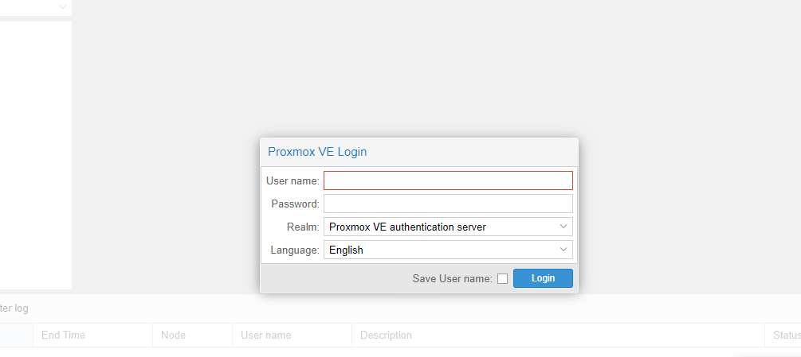

# Dokumentation Schüler

## Ziel

Der bereitgestellte Berufsschulserver, soll den Schülern die Möglichkeit geben, die im Unterricht theoretisch gelernten Dinge, auch einmal praktisch anwenden zu können.

In diesem konkreten Fall geht es um den Umgang mit unterschiedlichen Betriebssystemen und wie diese installiert werden. Dabei hat der Schüler die Möglichkeit, mithilfe von virtuellen Maschinen, die Installation einmal selbst vorzunehmen und sich so ein reales Abbild der Installation zu verschaffen.

## Allgemeine Übersicht Hardware

Das Gesamtsystem besteht aus 2 "Computern"  (Servern), einem Switch und einem Fileserver (Speicher).
Die Server sind per Glasfaser direkt und über Kreuz an den Speicher angeschlossen. Dadurch kann jeweils entweder ein Pfad bzw. ein Controller des Speichers oder ein Port einer FibreChannel (Glasfaser) Netzwerkkarte ausfallen ohne, dass der Betrieb beeinträchtigt wird.
Die Server sind des weiteren über ihre Netzwerkanschlüsse mit dem Switch verbunden.

## ProxMox Übersicht

Auf dieser Hardware läuft ProxMox, ein auf Debian basierender Open-Source Bare-Metal Hypervisor, der zum Betrieb von virtuellen Maschinen eingesetzt wird.

1. Um auf die Virtual Machine Übersicht zugreifen zu können, müsst ihr zunächst den Browser öffnen.

2. Anschließend fügt ihr dort nun eine IP-Adresse ein, diese bekommt ihr von der Lehrkraft mitgeteilt.
    - Wie das aussehen kann, seht ihr im unteren Bild.
    - 
    - **Wichtig hierbei ist die IP mit `https://` sowie der Portangabe einzufügen**.

3. Seid ihr nun in der Proxmox Oberfläche und habt die Warnmeldung eueres Browsers übersprungen, dann seht ihr nun folgende Übersicht:
    - 
3. Der Nutzername sowie das Passwort weist euch der Lehrer zu. Hier sollte darauf geachtet werden, dass unter Realm: ProxMox VE Authentication Server ausgewählt wird.
4. Wurden die korrekten Einstellungen getroffen, dann betätigt nun den Login Button. Jetzt seid ihr in ProxMox.
8. Wählt nun zum Schluss links oben noch die Pool View aus, welche es euch ermöglicht eure zugewiesenen VM's zu sehen.
   - 
